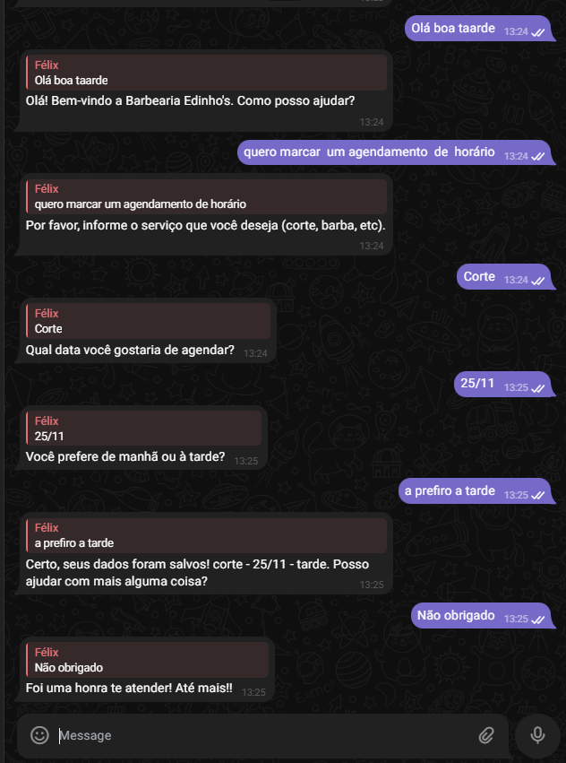
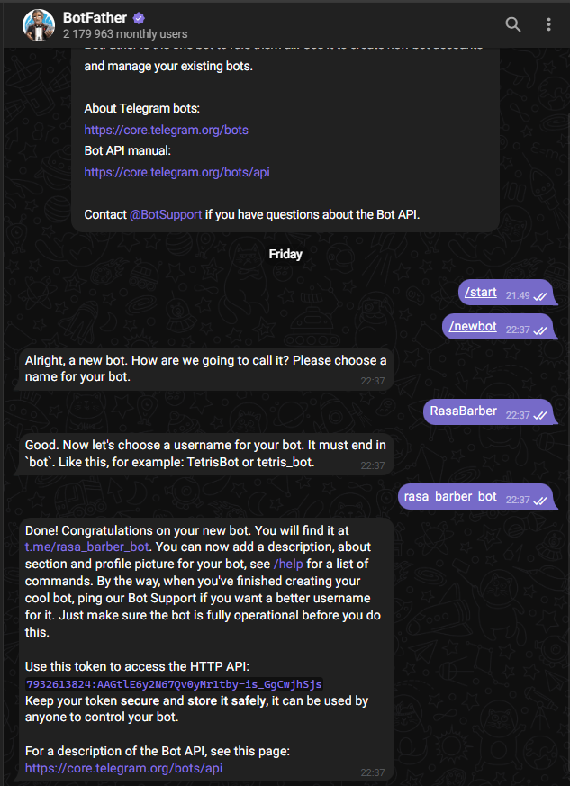
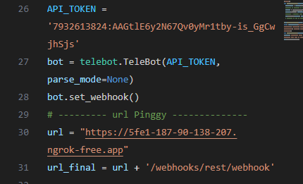

# RASA Barber Chatbot

Chatbot em RASA para atendimento de barbearia

# Instalação

Aqui estão os passos necessários para replicar o ambiente de desenvolvimento RASA no Windows

### Instalando WSL

```
wsl --update
wsl --set-default-version 2
wsl install --d ubuntu
```

### Instalação do Miniconda

1. Abra o terminal do Windows
2. Execute o seguinte comando:

- `wget https://repo.anaconda.com/miniconda/Miniconda3-latest-Linux-x86_64.sh`

3. Mova o arquivo baixado para a pasta home:
   Bash
   `mv Miniconda3-latest-Linux-x86_64.sh ~/`

Execute o seguinte comando:
Bash

```
bash ~/Miniconda3-latest-Linux-x86_64.sh
```

Siga as instruções na tela para concluir a instalação.

### Criando um ambiente virtual

1. Abra o terminal do Windows.
2. Execute o seguinte comando:
   Bash
   `conda create -n barber-chatbot python=3.9`
   ###### O detalhe do python=3.9 é muito importante para funcionar a insatalação do Rasa
3. Ative o ambiente virtual:
   Bash
   `conda activate barber-chatbot`

4. Instale pacotes no ambiente virtual:
   Bash
   `conda install numpy pandas matplotlib`

#### Para desativar o ambiente virtual:

`conda deactivate`

### Instale o RASA:

Use o comando
`pip3 install rasa.`

### Crie um projeto RASA:

Use o comando
`rasa init`

### Treine o modelo RASA: Use o

Utilize o comando dentro da pasta do projeto.
`rasa train`

### Teste o modelo RASA:

Use o comando
`rasa shell` dentro da pasta do projeto.

# Conectando ao Telegram

Com esse modelo é possivel conectar ao telegram atravésd o adaptador `conexao_python_telegram.py` e obter esse tipo de dialogo


### Iniciando o rasa:

Use o comando

```
rasa train --force
```

e

```
rasa run --enable-api --cors "*"  --debug
```

e ainda em outro terminal

```
rasa run actions
```

Tudo isso dentro da pasta do projeto e no perfil conda (barber-chatbot). Os comandos irão treinar o modelo e depois iniciar a aplicação e actions.

### Iniciando o adaptador com Telegram

Encontre o `BotFather` no Telegram e crie um novo bot através de

```
/start
/newbot
```



Copie o HTTP API token do seu bot e substitua no arquivo `conexao_python_telegram.py`

e juntamente com o `ngrok` com

```
ngrok http 5005
```

pegue o ip do Forwading e substiuta no aruqivo também.


Obs: O Telegram requer url https então "http://localhost" não funciona.

Agora basta enviar sua mensagem pelo telegram e terá resposta.

## Adicionais Telegram

Ao enviar uma imagem ou outro tipo de informação que não é do tipo texto o bot responde que ainda não sabe procesar:
 13.24.20_77e2fe92.jpg>)

### /start

 13.23.51_3eaf4c20.jpg>)

### /help

 13.24.00_d566c2c4.jpg>)
